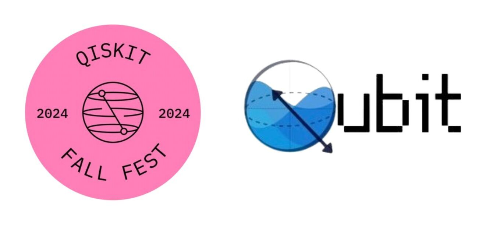

# Qubit & IBM Qiskit Fall Fest 2024

Welcome to the **Qubit & IBM Qiskit Fall Fest 2024** repository! This event is part of the global series of Qiskit Fall Fest events, where quantum enthusiasts from around the world come together to learn, collaborate, and explore the exciting field of quantum computing.

## Event Details

**Date:** 8th - 10th October 2024  
**Venue:** Ecole Centrale Mahindra University, Main Block  
**Timings:** 6:30 pm - 8:30 pm  

## Registration Link

To register for the event, please fill out the form: [Registration Form](https://forms.office.com/r/Yy9FjbtQUH)

## Join Our Discord

Connect with us on Discord: [Join the Discord Server](https://discord.gg/hUPfNgT6)

## Agenda

### 8th October 2024 (Day 1): Workshop 1 - Introduction to Quantum Mechanics and Computing

- **Overview**: This workshop covers the fundamentals of quantum mechanics and how they lay the groundwork for quantum computing.
- **Key Topics**:
  - **Quantum Mechanics**:
    - Dual nature of matter and wave properties
    - Heisenberg's Uncertainty Principle
  - **How Classical Computers Work**:
    - Understanding binary systems and classical logic gates
  - **Why Quantum? Classical vs. Quantum Computing**:
    - Comparison between classical and quantum systems
  - **Qubits**:
    - Introduction to qubits and their properties
    - Superposition, Entanglement, and Measurement
  - **Python Basics**:
    - A quick overview of Python syntax, data types, and essential functions for beginners.
  - **If Time Permits**:
    - Current Scenario and Prospects of Quantum Computers
    - Brief Overview of Research Domains in Quantum Computing

### 9th October 2024 (Day 2): Workshop 2 - Deeper Dive into Quantum Computing

- **Overview**: A deeper exploration of quantum computing concepts and practical applications.
- **Key Topics**:
  - **Recap of Day 1**: Review of major points from the previous day
  - **Classical Gates**: Refresher on classical logic gates like AND, OR, and NOT
  - **Bra-Ket Notation**: Introduction to Dirac’s notation for quantum states
  - **Quantum Gates**:
    - Learning about quantum gates such as Pauli-X, Hadamard, and CNOT
  - **Matrix Notation of Quantum Gates and the Bloch Sphere (If Time Permits)**:
    - Understanding matrix representation of quantum gates and visualizing qubits on the Bloch Sphere
  - **Hands-on with Qiskit Composer and Coding on Qiskit**:
    - Creating quantum circuits using IBM’s Qiskit Composer

### 10th October 2024: Hackathon Submission Deadline

- **Description**: The hackathon ends on this day. Participants are expected to submit their solutions by the end of the day.
- **Evaluation Criteria**: Submissions will be evaluated based on creativity, understanding of quantum concepts, and practical application of quantum computing.

### Hackathon Launch

We concluded the workshops with a multi-level hackathon, releasing customized Jupyter Notebooks tailored to different year groups:

- **1st & 2nd-year students**: Two levels 🏅
- **3rd-year students**: Three levels 🏅
- **4th-year students**: one levels 🏅

These notebooks are designed to match each group's skill level, providing a structured path to deepen their quantum computing knowledge. 

## Giveaways

We are excited to announce that we will be giving away awesome goodies and certificates! Participate in our events and activities for a chance to win these exciting rewards. Stay tuned for more details!

The prize pool of **₹12,000** added to the excitement, and every participant received goodies and certificates as a token of appreciation for their enthusiasm and hard work!

## Resources

### IBM Quantum Composer

We will be using **[IBM Quantum Composer](https://quantum.ibm.com/composer/files/new)** for practical experiments. This tool allows you to design, build, and simulate quantum circuits, enabling hands-on experience with quantum algorithms.

### Qiskit YouTube Channel

For additional tutorials and insights, visit the **[Qiskit YouTube Channel](https://www.youtube.com/@qiskit)**, which offers lectures, coding tutorials, and discussions on quantum algorithms.

#### Essential Resources for **Day 1** of Quantum Computing:

1. [Quantum Atlas - Entry List](https://quantumatlas.umd.edu/entry-list/)  
   - A comprehensive list of entries related to quantum computing for a solid foundation.

2. [Intro to Quantum Computing - Educative](https://www.educative.io/blog/intro-to-quantum-computing#physics)  
   - An introduction to quantum computing with a focus on the physics behind it.

3. [IBM Quantum Computing Roadmap](https://www.ibm.com/roadmaps/quantum/)  
   - IBM's vision and roadmap for the future of quantum computing technology.

#### Essential Resources for **Day 2** of Quantum Computing:

1. [Quantum Country - Quantum Computing Visualized](https://quantum.country/qcvc)  
   - This interactive resource provides a deep dive into quantum concepts, using a visual and memory-aid approach to learn efficiently.

## Organizing Team & Contact Info

- **Jayasri D**
- **Sreeraj Rajan**
- [**Ritika Buchupalli**](https://github.com/ritika0101)
- [**T. Jugal Kishore Reddy**](https://github.com/tjkreddy)
- **Krishna Chaithanya P**

For any queries, feel free to reach out to any of the team members listed above.
