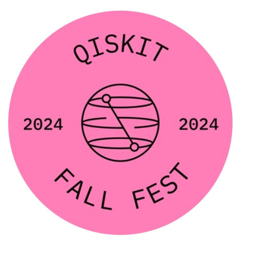

# Qubit & IBM Qiskit Fall Fest 2024

Welcome to the **Qubit & IBM Qiskit Fall Fest 2024** repository! This event is part of the global series of Qiskit Fall Fest events, where quantum enthusiasts from around the world come together to learn, collaborate, and explore the exciting field of quantum computing.

## Event Details

**Date:** 7th - 10th October 2024  
**Venue:** Ecole Centrale Mahindra University, Main Block.  
**Timings:** 6:30pm - 8:30pm.

## Agenda

### 7th September 2024: Hackathon Problem Statement Release

- **Description**: The problem statement for the hackathon will be released. The challenge will involve leveraging quantum computing concepts and tools to address real-world problems.
- **Objective**: Kick-off of the hackathon. Participants will receive the problem statement, giving them time to strategize and plan their submissions.

### 8th September 2024 (Day 1): Workshop 1 - Introduction to Quantum Mechanics and Computing

- **Overview**: This workshop will cover the fundamentals of quantum mechanics and how they lay the groundwork for quantum computing.
- **Key Topics**:
  - **Quantum Mechanics**:
    - Dual nature of matter and wave properties
    - Heisenberg's Uncertainty Principle
  - **How Classical Computers Work**:
    - Understanding binary systems and classical logic gates
  - **Why Quantum? Classical vs. Quantum Computing**:
    - Comparison between classical and quantum systems
  - **Qubits**:
    - Introduction to qubits and their properties
    - Superposition, Entanglement, and Measurement
  - **If Time Permits**:
    - Current Scenario and Prospects of Quantum Computers
    - Brief Overview of Research Domains in Quantum Computing

### 9th September 2024 (Day 2): Workshop 2 - Deeper Dive into Quantum Computing

- **Overview**: A deeper exploration of quantum computing concepts and practical applications.
- **Key Topics**:
  - **Recap of Day 1**: Review of the major points from the previous day
  - **Classical Gates**: Refresher on classical logic gates like AND, OR, and NOT
  - **Bra-Ket Notation**: Introduction to Dirac’s notation for quantum states
  - **Quantum Gates**:
    - Learning about quantum gates such as Pauli-X, Hadamard, and CNOT
  - **Matrix Notation of Quantum Gates and the Bloch Sphere (If Time Permits)**:
    - Understanding the matrix representation of quantum gates and visualizing qubits on the Bloch Sphere
  - **Hands-on with Qiskit Composer**:
    - Creating quantum circuits using IBM’s Qiskit Composer

### 10th September 2024: Hackathon Submission Deadline

- **Description**: The hackathon ends on this day. Participants are expected to submit their solutions by the end of the day.
- **Evaluation Criteria**: Submissions will be evaluated based on creativity, understanding of quantum concepts, and practical application of quantum computing.

## Resourses

### IBM Quantum Composer

We will be using **[IBM Quantum Composer](https://quantum.ibm.com/composer/files/new)** for practical experiments. This tool allows you to design, build, and simulate quantum circuits, enabling hands-on experience with quantum algorithms.

### Qiskit YouTube Channel

For additional tutorials and insights, visit the **[Qiskit YouTube Channel](https://www.youtube.com/@qiskit)**. The channel offers a variety of content, including quantum computing lectures, coding tutorials, and discussions on quantum algorithms.

Below are some essential resources to help you get started with **Day 1** of your quantum computing journey:

1. [Quantum Atlas - Entry List](https://quantumatlas.umd.edu/entry-list/)
   - A comprehensive list of entries related to quantum computing, providing a solid foundation for beginners.

2. [Intro to Quantum Computing - Educative](https://www.educative.io/blog/intro-to-quantum-computing#physics)
   - This article offers an introduction to quantum computing and explores the physics behind it.

3. [IBM Quantum Computing Roadmap](https://www.ibm.com/roadmaps/quantum/)
   - Explore IBM's vision and development roadmap for the future of quantum computing technology.
These resources will help guide you through the quantum computing concepts and tools for **Day 1**.

Below are some essential resources to help you get started with **Day 2** of your quantum computing journey:

1. [Quantum Country - Quantum Computing Visualized](https://quantum.country/qcvc)
   - This interactive resource provides a deep dive into quantum computing concepts, using a visual and memory-aid approach to help you learn efficiently.

This resource will help you further explore quantum computing concepts on **Day 2**.

## Organizing Team & Contact Info

- **Jayasri D**
- **Sreeraj rajan**
- **Ritika Buchupalli**
- **T. Jugal Kishore Reddy**
- **Krishna Chaithanya P**

For any queries related to the event, feel free to reach out to any of the team members listed above.

  <!-- Adjust the path accordingly -->
